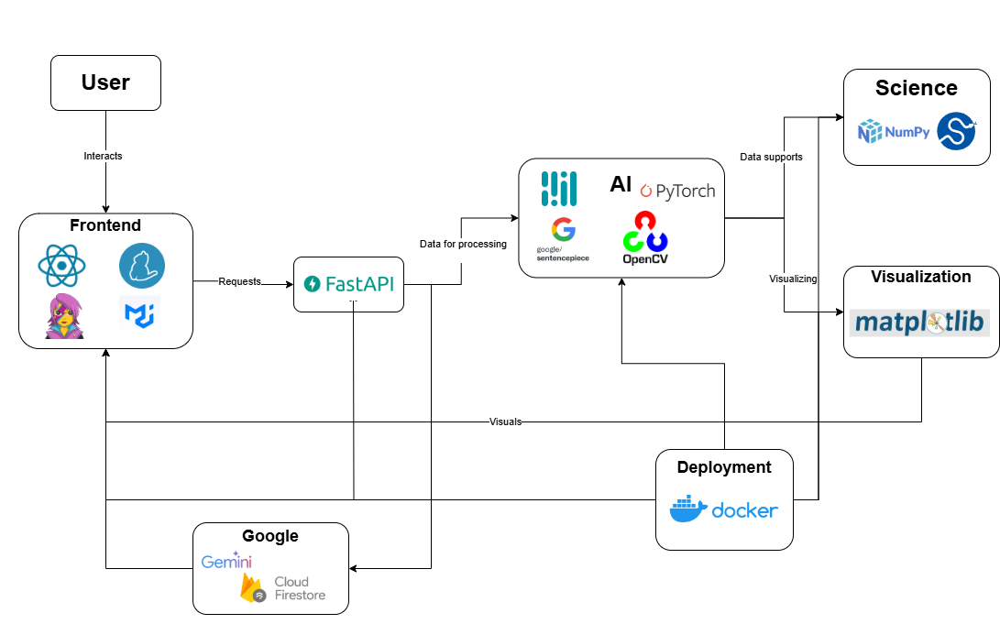
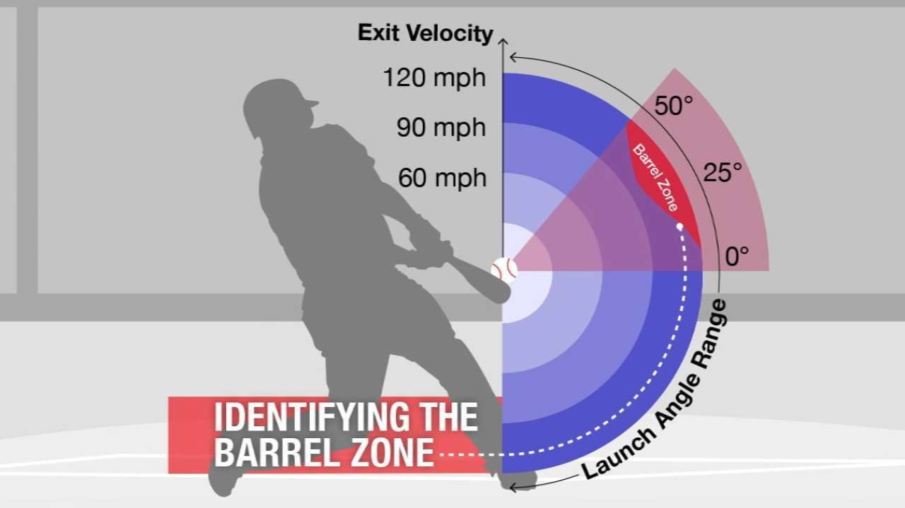
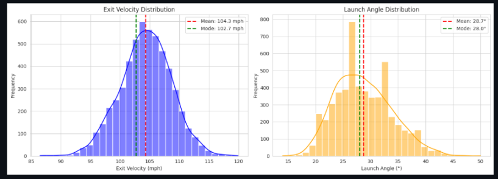

# SlugSeiAI

## Inspiration

Baseball is a game of precision, but not everyone has access to elite coaching. What if you could see exactly how to improve your swing, down to the smallest detail? 

With SlugSei, players at any level can unlock their potential using real-time data like launch angle (optimized at 10-30 degrees), exit velocity (elite players average 95+ mph), and bat speed (just 1-2 mph faster can add 10-15 feet to your hits). Studies show players using data-driven coaching improve batting averages by up to 20% and gain 5-7 mph in exit velocity in just months. It’s not just practice, it’s practicing smarter. SlugSei makes pro-level insights accessible, so user can see measurable results faster.

## What it does

SlugSei is an AI baseball coach that analyzes your swing mechanics through video and delivers instant, actionable feedback to elevate your hitting performance. Using advanced computer vision and machine learning, it tracks and measures critical metrics to help you improve faster and smarter.

Key Features

- Swing Analysis: Tracks bat speed, stance, hand positioning, follow-through, launch angle, and exit velocity.

- Instant Feedback: Provides real-time insights on your swing mechanics and areas for improvement.

- Performance Tracking: Monitors your progress over time with detailed metrics and trends.

- Personalized Coaching: Offers tailored recommendations and drills based on your unique swing data.

- Pro Comparisons: Compare your swing mechanics to professional athletes for benchmark insights.

- Drill Library: Access customized drills designed to target specific weaknesses and refine your skills.

- Data Storage: Save and review your swing history to track improvement and set goals.

SlugSei turns raw data into actionable steps, helping you practice smarter and see measurable results faster.

## How we built it

We leveraged computer vision models trained on thousands of baseball swings to detect key movement patterns. Using OpenCV and MediaPipe, we tracked skeletal motion, while TensorFlow powered our AI models to analyze performance metrics. The backend was built with FastAPI, handling video processing and model inference efficiently, and deployed on Google Cloud Run for scalability. The frontend provides an intuitive dashboard where users can upload videos, view analytics, and receive AI-generated coaching feedback.

## Our detection Model

Our detection model is built using a combination of computer vision techniques and data analysis to track baseball movement accurately. First, we extract important details from video files, including frame rate, resolution, and total frame count. This ensures that our calculations for speed and trajectory remain consistent across different recordings. To detect the baseball, we use HSV color thresholding, which isolates the ball from the background based on its white color. We then refine the detection using morphological operations to reduce noise and improve accuracy. By filtering contours based on size and shape, we can reliably identify the baseball in each frame.

Instead of using complex tracking algorithms, we take a frame-by-frame approach, detecting the baseball independently in every frame. This method is simple yet effective, allowing us to maintain accuracy even when the ball is temporarily out of view. Once we have a series of detected positions, we fit a quadratic curve to model the baseball’s trajectory. This helps us determine key metrics like launch angle and exit velocity, as a parabolic curve closely represents how a baseball moves through the air. To ensure our speed calculations are realistic, we use a conversion factor based on real-world measurements. Additionally, we created a visualization tool that plots the detected ball positions, helping us verify the accuracy of our trajectory analysis.

Beyond detection, we analyze MLB player data to provide useful comparisons. Since player performance varies widely, we use full-season datasets to determine the average and most common performance levels. By plotting a density curve, we can identify trends and compare an individual player’s stats against the overall distribution. Instead of normalizing the data to a scale from 0 to 1, we display actual frequency counts on the y-axis, making the information more meaningful and easier to interpret. This analysis helps players understand exactly where they stand compared to top athletes and highlights areas where they can improve. Our approach balances accuracy and simplicity, offering a practical and affordable solution for tracking and evaluating baseball performance.

Read this article for further analysis

## Challenges  

One of the biggest challenges was ensuring real-time feedback while processing high-resolution video, as optimizing model inference speed without compromising accuracy was tricky. Lighting variations, such as shadows and glare, wreaked havoc on detection, requiring parameter adjustments. Similar-looking objects like player helmets and bases triggered false positives, despite strict filtering. Processing speed was initially slow, running at about 10 FPS, necessitating function optimizations. Calibration consistency varied with camera position and zoom level, and frame limitations required analysis to be capped at 300 frames. Despite these challenges, we successfully implemented real-time swing analysis, optimized video processing for scalability, and developed an intuitive user interface.

## Accomplishments 
- Successfully implemented real-time AI swing detection analysis that provides actionable feedback.
- Optimized video processing to run smoothly on Google Cloud Run, ensuring scalability.
- Developed an intuitive user interface that makes AI coaching accessible to players of all skill levels.
- Trained a robust model that can detect and suggest corrections for swing mechanics with high accuracy.

## What we learned

This project reinforced the importance of efficient model deployment and optimization, especially when handling computationally expensive tasks like video processing. We also learned how to fine-tune AI models for motion analysis and integrate computer vision pipelines into a production-ready environment. Lastly, we gained a deeper appreciation for user experience design, ensuring that AI-generated insights are presented in an easy-to-understand manner for athletes.

## What’s next?

We plan to expand Slugsei’s capabilities by incorporating pitch recognition analysis, allowing batters to train against different pitch types. Additionally, we aim to develop a mobile app for on-the-go swing analysis and integrate real-time feedback via AR overlays. Beyond baseball, we see potential in applying this technology to other sports that rely on biomechanics, such as golf and tennis. Our goal is to revolutionize sports training with AI coaching for everyone regardless of whether they're pro or amateur!

Test it out here:
https://virtual-baseball-coach-ui-159395849557.us-central1.run.app

